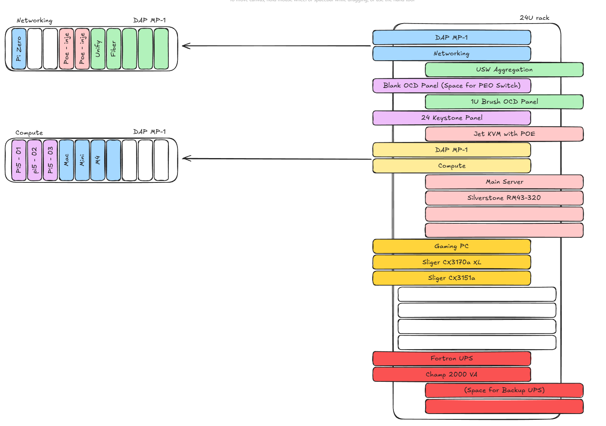

# 🏠 Home Lab Infrastructure (WIP)

A comprehensive documentation repository for my self-hosted infrastructure, including configurations, Docker Compose files, and automation scripts for learning and disaster recovery.

## 📋 Overview

This repository serves as the central documentation and configuration management for my home lab environment.
It contains everything needed to understand, maintain, and rebuild my infrastructure from scratch.

## 🏗️ Infrastructure Stack
- **Hypervisor:** Proxmox VE for VM's
- **Storage:** Unraid
- **Networking:** Ubiquity Ecosystem For Life

## 🧰 Hardware

- **Rack:** 19' OCRACK OCC-25U-68SBK
  - **Accesories**:
    - [R20 Series II Rack Mounting Screws](https://amzn.to/49CW2ry)
  - **The Beast:** Main Server Running Unraid (WIP -> Proxmox with Unraid inside)
    - **Case:** Silverstone RM43-320-RS
    - **Montherboard:** ROG STRIX B550-E GAMING
    - **CPU:** AMD Ryzen 9 5900X
    - **RAM:** 96 GiB DDR4 Multi-bit ECC
    - **GPU:** EVGA GeForce RTX 3090 FTW3 ULTRA
    - **PSU:** Seasonic Vertex PX-1000 Platinum
    - **DISK:**
      - [Seagate Exos 10TB](https://amzn.to/43YUjsR)
    - **PCIE Add In's:**
      - [NICGIGA 10Gb Dual LAN SFP+ PCI-e Network Card, Intel 82599 (X520) Controller](https://amzn.to/43MIru0)
      - [KALEA-INFORMATIQUE PCIe 3.0 SAS 12GB Controller Card with 24 Internal Ports OEM Model 9305-24i](https://amzn.to/49GGAKY)
    - **Others:**
      - [Noctua NF-R8 redux-1800 PWM](https://amzn.to/4qTknQc)
## 💾 Unraid

### Storage Configuration
- **Main Array:**
  - Parity	   ST8000NM017B-2TJ103_WWZ8PBWX - 10 TB 
  - Disk 01	WDC_WD40EFAX-68JH4N1_WD-WXA2A92770XN - 4 TB 
  - Disk 02	WDC_WD40EFAX-68JH4N1_WD-WX52D62RAYXY - 4 TB 
  - Disk 03	WDC_WD40EFAX-68JH4N1_WD-WX62A92P2AT0 - 4 TB 
  - Disk 04	ST4000VN008-2DR166_ZGY9DD49 - 4 TB 
  - Disk 05	ST6000NM021A-2R7101_WS304BBL - 6 TB 
  - Disk 06	ST6000NM019B-2TG103_WX01E4K5 - 6 TB 
  - Disk 07	ST6000NM019B-2TG103_WX01E888 - 6 TB 
  - Disk 08	ST6000NM019B-2TG103_WX01HCGR - 6 TB 
  - Disk 09	ST6000NT001-3M1101_WX00LEJY - 6 TB 
  - Disk 10   ST8000NM017B-2TJ103_WWZ8Y2PS - 8 TB 
- **Cache Pool:**
  - WD_BLACK_SN770_2TB_23037F451103 - 2 TB

## 📁 Repository Structure
<!-- 
.
├── docker/                    # Docker Compose configurations
│   ├── media/                # Media services (Plex, etc.)
│   ├── networking/           # Network services (Pi-hole, VPN)
│   ├── monitoring/           # Monitoring stack
│   ├── automation/           # Automation tools
│   └── utilities/            # Utility services
├── ansible/                   # Ansible playbooks
│   ├── playbooks/
│   ├── roles/
│   └── inventory/
├── scripts/                   # Automation scripts
│   ├── backup/
│   ├── maintenance/
│   └── deployment/
├── docs/                      # Additional documentation
│   ├── network-diagram.md
│   ├── services.md
│   └── troubleshooting.md
├── configs/                   # Configuration templates
│   ├── proxmox/
│   └── networking/
└── CHANGELOG.md              # Change log for infrastructure updates
-->

## 🚀 Services

## 📚 Documentation

<!-- 
- **[Network Architecture]()** - Network topology and design decisions
- **[Service Inventory]()** - Complete list of all running services
- **[Backup Strategy]()** - Backup procedures and schedules
- **[Disaster Recovery]()** - Recovery procedures
- **[Security Practices]()** - Security configurations and hardening
- **[Troubleshooting]()** - Common issues and solutions
-->

## 📝 Change Management

<!--
All infrastructure changes are documented in [CHANGELOG.md](CHANGELOG.md) following this format:
- Date of change
- What changed
- Why it changed
- Any issues or rollback procedures
-->

## 🤝 Contributing & Learning

This repository is public to:
- Share knowledge with the home lab community
- Provide examples for others learning self-hosting
- Document my own learning journey

Feel free to:
- Open issues for questions or suggestions
- Submit pull requests for improvements
- Use this as inspiration for your own setup

## 📖 Resources for Tools & Inspiration

- [mikeroyal/Self-Hosting-Guide](https://github.com/mikeroyal/Self-Hosting-Guide)
- [Proxmox-community-scripts](https://community-scripts.github.io/ProxmoxVE/scripts?id=scaling-governor&category=Proxmox+%26+Virtualization)
- [Proxmox-tteck-scripts](https://tteck.github.io/Proxmox/)
- [virtualizationhowto](https://www.virtualizationhowto.com)
- [ChristianLempa](https://github.com/ChristianLempa)
- [jeffgeerling](https://www.jeffgeerling.com)
- [technotim](https://technotim.live)

## ⚠️ Disclaimer

This is a personal home lab for learning and experimentation. 
Configurations may not follow enterprise best practices. 
Use at your own risk and always test before deploying to production environments.

## 💰 Hardware Affiliate Disclosure
Some hardware links in this repository are Amazon affiliate links. If you purchase through these links, I may earn a small commission at no additional cost to you. I only recommend hardware I've personally used or thoroughly researched for my home lab.
